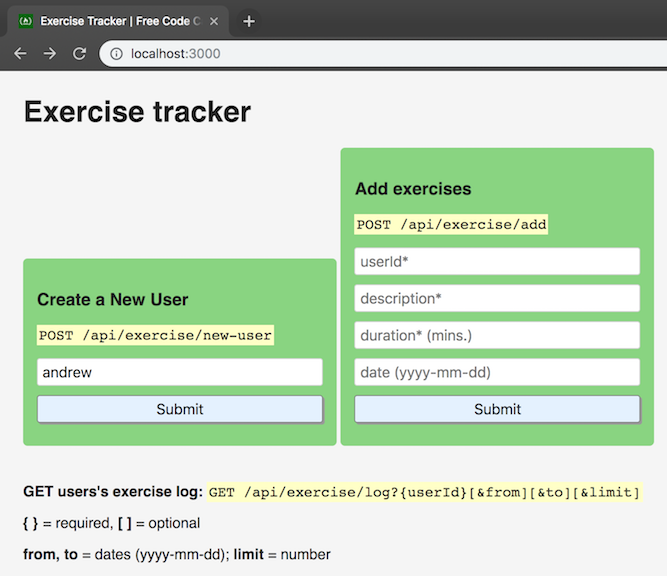
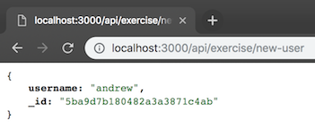
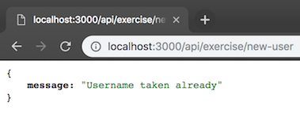
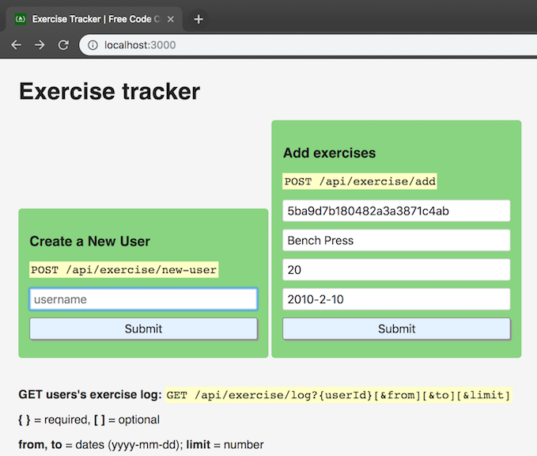
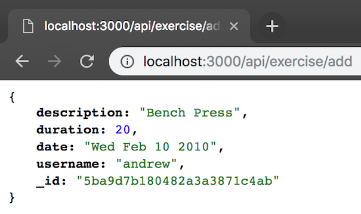
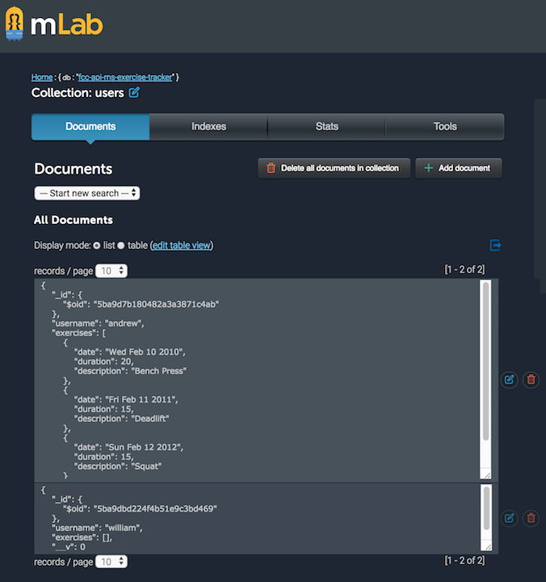
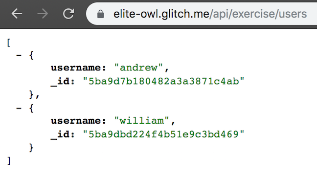
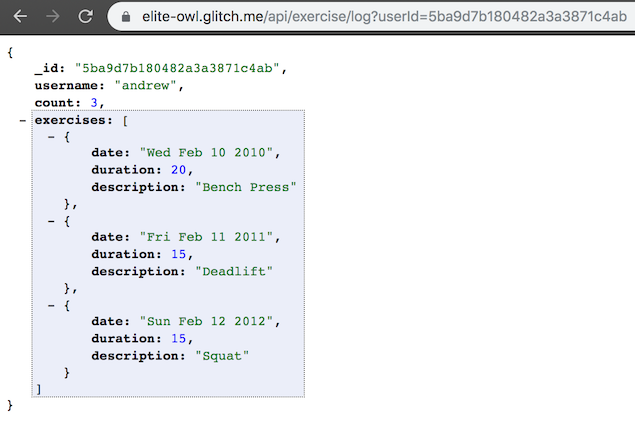
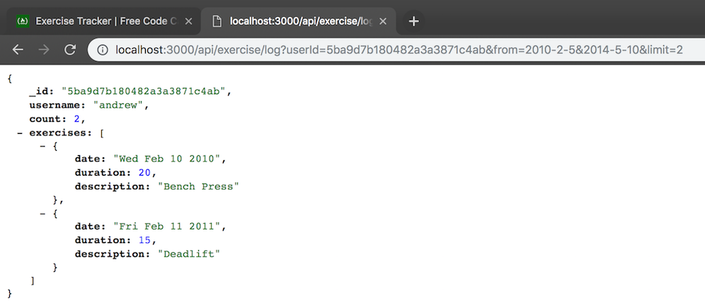
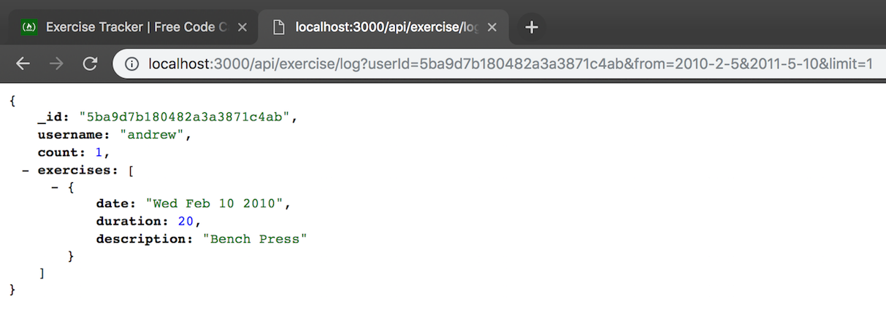

# API Project: Exercise Tracker Microservice for freeCodeCamp - Completed

## View on [Glitch](https://elite-owl.glitch.me/)

## Endpoints created:

POST /api/exercise/new-user

POST /api/exercise/add

GET /api/exercise/users

GET /api/exercise/:id => User details and log of [optionally filtered] exercises

## To run this project locally

1. Https or SSH download this project.
2. `npm install`
3. [Critical] Populate process.env.MONGOLAB_URI with your mongoDB URI from mLab
4. Navigate to localhost:3000/

### User Stories

1. I can create a user by posting form data username to /api/exercise/new-user and returned will be an object with username and \_id.
2. I can get an array of all users by getting api/exercise/users with the same info as when creating a user.
3. I can add an exercise to any user by posting form data userId(\_id), description, duration, and optionally date to /api/exercise/add. If no date supplied it will use current date. Returned will the the user object with also with the exercise fields added.
4. I can retrieve a full exercise log of any user by getting /api/exercise/log with a parameter of userId(\_id). Return will be the user object with added array log and count (total exercise count).
5. I can retrieve part of the log of any user by also passing along optional parameters of from & to or limit. (Date format yyyy-mm-dd, limit = int)
